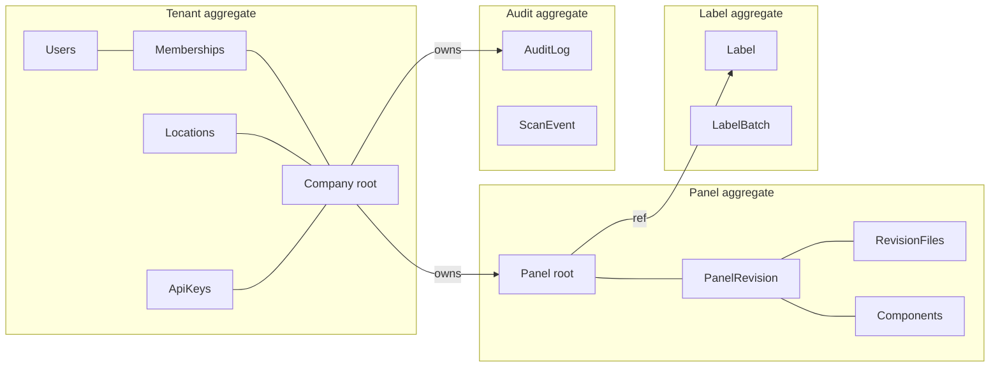

# Data Model — Aggregates

The relational schema in [database/schema.md](../database/schema.md) is grouped into a small set of **DDD aggregates**. This page names the aggregate roots, invariants, and cross-aggregate references.

## Aggregates

## Roots and invariants

### Panel (root)
- Identity (`tag`, `serial`, `qr_token`) is **immutable** after insert. Enforced by a Postgres trigger that raises on UPDATE of those columns. See [ADR-0005](../adr/0005-revision-immutability.md).
- `active_revision_id` may be NULL (panel exists, no approved revision yet) or point to exactly one `panel_revisions.id` with `status='approved'`.
- All FKs from panel descendants carry `company_id` denormalized — for RLS performance.

### PanelRevision (within Panel)
- `unique (panel_id, revision_number)`.
- Status transitions enforced in `revision_service` (see [revision-system](./revision-system.md)).
- On approval, the previous `approved` revision is set to `superseded` in the same transaction.

### Component (within Revision)
- `(revision_id, slot)` unique per revision.
- Components are *snapshots* — a new revision copies and edits, never edits a prior revision’s rows.

### Label / LabelBatch (root)
- A label snapshots `fields_json` so re-rendering a year later matches the printed tag.
- LabelBatch holds an ordered `items_json` referencing label ids.

### AuditLog (root)
- Append-only. Hash chain: `hash = sha256(prev_hash || canonical_json(row))`.
- A nightly verifier job re-walks the chain and flags breaks.

### ScanEvent (root)
- Append-only. Driven by the public QR resolver.

## Cross-aggregate references

Allowed (read-only) cross-aggregate FKs:

| From | To | Why |
|---|---|---|
| `panel_revisions.created_by` | `users.id` | actor of the draft |
| `labels.revision_id` | `panel_revisions.id` | snapshot of what was printed |
| `scan_events.panel_id` | `panels.id` | scan referent |
| `audit_logs.actor_id` | `users.id` | who did it |

## Tenant root

`companies.id` is the RLS partitioning key. Every tenant-owned row carries `company_id NOT NULL`. RLS policies compare to `current_setting('app.company_id')`. See [multi-tenancy](./multi-tenancy.md) and [ADR-0006](../adr/0006-postgres-rls-for-tenancy.md).
