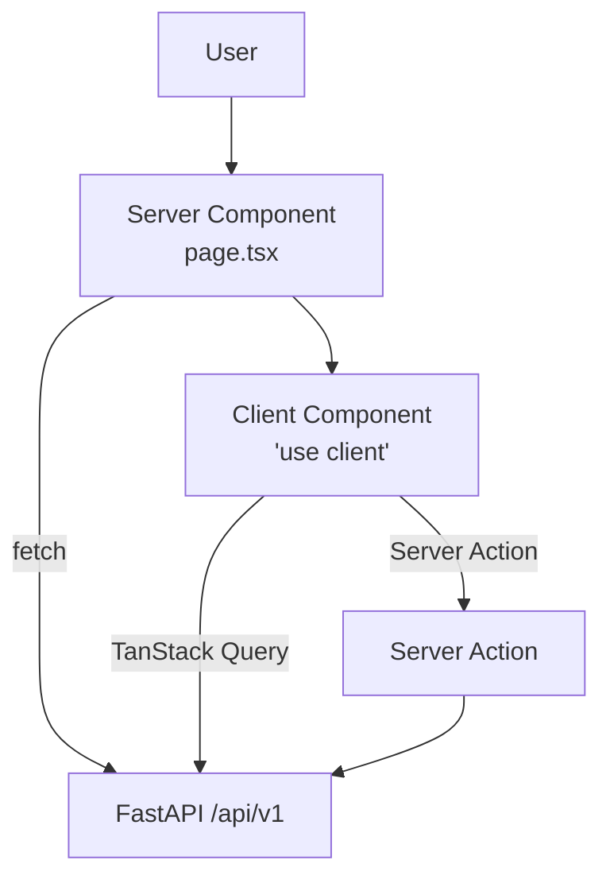

# Frontend Architecture

`apps/web` is a Next.js 15 App Router TypeScript application. This page explains rendering boundaries, data flow, and the theme/density/accent system that maps to the design tokens.

See also: [design-system](../design/design-system.md) · [handoff](../design/handoff.md) · [ADR-0003](../adr/0003-nextjs-app-router.md).

## Route groups

| Group | Purpose | Auth |
|---|---|---|
| `(marketing)` | Public marketing pages (optional) | none |
| `(auth)` | `/login`, `/sso/callback` | none |
| `(app)` | Authenticated app shell (Sidebar + TopBar) | required, gated in `middleware.ts` |
| `q/[token]` | Public QR resolver — server-side redirect | none |

## Server vs client

- **Server components by default.** Shells, layouts, list pages that read straight from the API.
- **Client components for interactivity**: tables with selection, tabs, modals, palette, drag/drop, theme provider.
- Server actions for mutations that don't need optimistic UX; TanStack Query mutations for those that do.



## Data fetching

- Typed API client generated from FastAPI’s OpenAPI via `openapi-typescript` into `packages/types`.
- TanStack Query for client cache; `staleTime` defaults to 30s, mutated invalidations are explicit.
- 401 interceptor calls `/api/v1/auth/refresh`; if that fails, redirect to `/login`.

## Auth

- HTTP-only secure cookies set by `/api/v1/auth/login`.
- `middleware.ts` gates `(app)` routes; reads tenant from `panelos_tenant` cookie.
- Server components forward the cookie via `cookies()` from `next/headers`.

## Theme / density / accent

Driven by `data-*` attributes on `<html>`, written by `ThemeProvider` (client). CSS variables in `src/styles/design-tokens.css` (port of `/tmp/panelhub_design/panelos/project/styles.css`) react to attribute selectors:

```html
<html data-theme="light" data-accent="blue" data-density="default">
```

| Attribute | Values |
|---|---|
| `data-theme` | `light` (default), `dark` |
| `data-accent` | `blue` (default), `cyan`, `indigo`, `steel` |
| `data-density` | `compact`, `default`, `comfortable` |

Tailwind config exposes each CSS var as a token (`colors.canvas`, `colors.surface`, `spacing.rowH`, …) so shadcn/ui components compose without bespoke styling.

## Component inventory

Mapped from prototype files in [handoff](../design/handoff.md). Inventory in [components](../design/components.md).

## Routing decisions

- App Router exclusively; no `pages/` dir.
- `q/[token]/route.ts` is a Route Handler returning 302 — no React rendered.
- All `(app)` routes share `(app)/layout.tsx` which mounts the Sidebar + TopBar.

## Performance

- Server components ship zero JS for static panels.
- Dynamic imports for `react-pdf` and `qrcode.react` (heavy, viewer-only).
- Image optimization via Next/Image for the logo + screenshots only; we don’t ship user content as ``.
