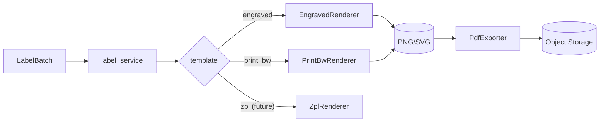

# Label Rendering

Labels are how panels are physically identified on the cabinet. PanelOS renders two formats in MVP and reserves seams for thermal printer SDKs. See [ADR-0010](../adr/0010-no-printer-sdk-mvp.md).

## Renderer protocol

```python
class LabelRenderer(Protocol):
    template: str  # "engraved" | "print_bw"
    async def render_png(self, label: Label) -> bytes: ...
    async def render_svg(self, label: Label) -> bytes: ...
```

Implementations:

| Renderer | Output | Used for |
|---|---|---|
| `EngravedRenderer` | PNG (Pillow) + SVG | Dark phenolic plastic tag — long-life nameplate |
| `PrintBwRenderer` | PNG + SVG | Adhesive B/W label on 90×50mm office paper stock |
| `ZplRenderer` (future) | ZPL text | Zebra thermal printers |
| `BrotherRenderer` (future) | Brother raster format | P-Touch series |

A `PdfExporter` consumes a `LabelBatch` and arranges labels onto chosen paper stock via `reportlab` imposition.

## Templates

Template parameters live in `labels.fields_json` so changes to template definitions in `Settings → Branding` do not require code edits. Required IEC 61439 fields:

- Tag (large, mono).
- Voltage / Current / Phase.
- Manufacturer.
- Serial number.
- IP class.
- QR + URL.

See [design/label-templates](../design/label-templates.md) for exact dimensions and typographic specs.

## Adapter pattern



Mermaid source: [./diagrams/label-render.mmd](./diagrams/label-render.mmd).

## Persistence

Each `Label` row stores `output_storage_key` so re-printing a label months later reuses the exact PNG that was previously printed — no surprise drift if a template changes.

## Print queue

`LabelBatch.items_json` is an ordered array of `{label_id, copies}`. Status: `pending → rendering → ready → printed`. Rendering happens in an `rq` job; the user gets a notification when `ready`.
