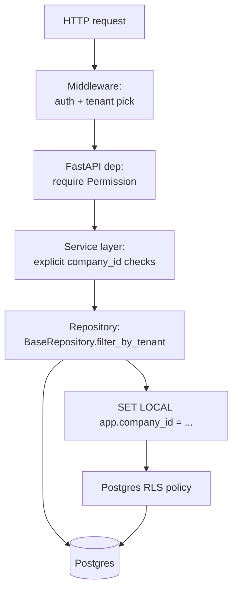

# Multi-Tenancy

PanelOS is **multi-tenant from row zero**. Every tenant-scoped row carries `company_id`, and Postgres Row-Level Security (RLS) is the backstop against application bugs. See [ADR-0006](../adr/0006-postgres-rls-for-tenancy.md).

## Tenancy model

- **Tenant = Company.** One `companies` row per customer organization.
- Users are global identities (`users.email` is globally unique).
- A user belongs to one or more tenants via `memberships(user_id, company_id, role)`.
- The active tenant for a request is determined from the `panelos_tenant` cookie (web) or `X-PanelOS-Tenant` header (API/mobile); the chosen tenant must match a membership for the authenticated user, else 403.

## Enforcement layers



Belt-and-suspenders: even if a developer forgets `filter_by_tenant`, RLS rejects the row. Even if RLS is misconfigured for a new table, the application layer still scopes.

## RLS policy template

```sql
CREATE POLICY tenant_isolation ON {table}
  USING (company_id = current_setting('app.company_id')::uuid);
```

Applied to every tenant-scoped table by an Alembic helper.

## Setting the tenant per request

A FastAPI dependency runs `SET LOCAL app.company_id = '<uuid>'` on the request’s connection before any query. The setting resets at transaction end (`LOCAL`), so connection reuse across tenants is safe.

## Switching organizations

The web app exposes an org switcher in the top bar. Clicking another org:

1. Posts to `/auth/switch-tenant`.
2. Server verifies membership.
3. Sets a fresh `panelos_tenant` cookie.
4. Client invalidates TanStack Query cache.
5. User lands on Dashboard of new tenant.

## Cross-tenant guardrails

| Risk | Mitigation |
|---|---|
| Forgotten `company_id` in repo query | Mandatory `BaseRepository`; `mypy` plugin flags raw `select(Model)` outside repo |
| Tenant-leaking error message | Sanitized error renderer never echoes IDs from another tenant |
| Cross-tenant FK | Migration linter rejects FK without `company_id` denormalization on child |
| Admin "support" access | A separate `SupportImpersonation` flow writes a special audit log and shows a banner |

## Globally unique resources

- `users.email` — global.
- `panels.qr_token` — global (the public resolver scans by token alone).
- `companies.slug` — global, URL-safe.
