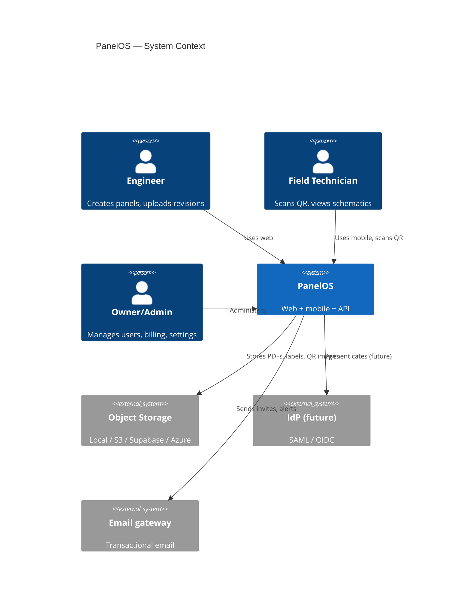
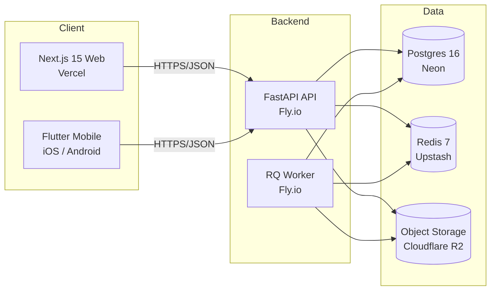

# Architecture Overview

PanelOS is a **monolith-first** SaaS: one FastAPI deployable, one Next.js deployable, one Postgres, one Redis, pluggable object storage. This page is the entry point for the architecture tree; subsequent pages drill in.

See also: [backend](./backend.md) · [frontend](./frontend.md) · [data-model](./data-model.md) · [storage](./storage.md) · [revision-system](./revision-system.md) · [qr-system](./qr-system.md) · [labels](./labels.md) · [multi-tenancy](./multi-tenancy.md) · [future-ai](./future-ai.md).

## Why monolith-first

Per [ADR-0001](../adr/0001-monolith-first.md): the team is small, the domain is bounded, and the volume profile (thousands of panels per tenant, kilobytes of metadata per panel, occasional PDF uploads) does not warrant microservices. We keep service boundaries crisp inside the codebase (router → service → repository) so we can extract a service later without rewrites.

## C4 — Context



## C4 — Containers



Mermaid sources live in [./diagrams/](./diagrams/).

## Cross-cutting properties

| Property | Approach | Doc |
|---|---|---|
| Tenancy | `company_id` + Postgres RLS | [multi-tenancy](./multi-tenancy.md) |
| Identity | JWT (RS256) + rotating refresh | [ADR-0009](../adr/0009-jwt-with-rotating-refresh.md) |
| Authorization | `require(Permission.X)` dep + RLS belt | [rbac](../security/rbac.md) |
| Storage | `StorageProvider` Protocol + factory | [storage](./storage.md) |
| Auditing | Hash-chained `audit_logs` | [data-model](./data-model.md) |
| Observability | OpenTelemetry → Grafana Cloud | [monitoring](../operations/monitoring.md) |
| Configuration | `pydantic-settings`, 12-factor env | [setup](../development/setup.md) |

## Repository map

```
apps/web      Next.js 15 App Router
apps/api      FastAPI + SQLAlchemy + Alembic
apps/mobile   Flutter (skeleton)
packages/ui   Design tokens
packages/types  Generated openapi types
infra/        Docker, compose, k8s scaffolds
docs/         You are here
```
