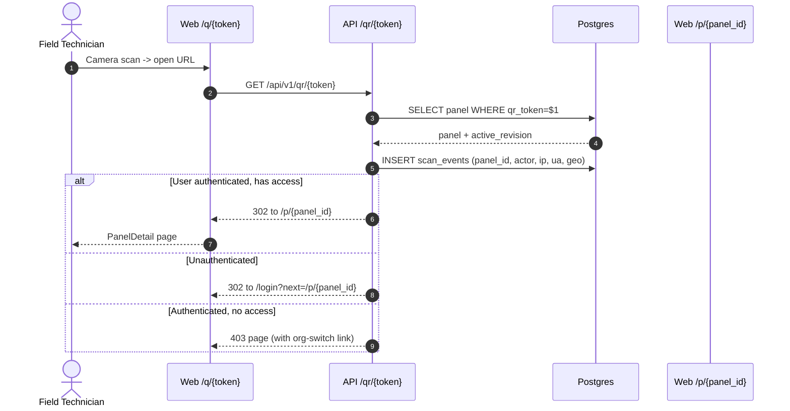

# QR System

A panel’s QR is its public, permanent address. The label is engraved or printed once and must outlive every revision. See [ADR-0007](../adr/0007-server-side-qr-generation.md).

## Token

- 22-character URL-safe **nanoid** (alphabet `A-Za-z0-9_-`), ~131 bits of entropy.
- Generated by `core/ids.py:new_qr_token()` at panel insert.
- Stored as `panels.qr_token`, **unique global** (not just per tenant — the public resolver doesn’t know the tenant yet).
- A Postgres trigger raises on UPDATE of `qr_token`.

## URL

```
https://panelos.app/q/{token}
```

Rendered on the engraved tag (Code 128 alongside is optional). The host is configurable per tenant via Settings → Branding → "QR base URL" (default uses platform domain).

## Public resolver



Mermaid source: [./diagrams/qr-resolver.mmd](./diagrams/qr-resolver.mmd).

## Mobile signed deep links

The mobile app uses a signed JWT-in-URL fragment (`#sig=…`) appended by the API when the user is already signed in on web. Camera scan → universal link opens the app → deep link routes to the panel screen offline-aware.

## Rendering

- `segno` renders SVG (vector) and PNG.
- Cached in storage at `qr/{token}.svg` and `qr/{token}.png` (300dpi for engraving).
- Error correction level **H** (30% recovery) for shop-floor wear tolerance.

## Privacy

The token is unguessable but not authenticated. Treat the URL as a "capability to *attempt* access" — the resolver still enforces RBAC and RLS. Scan events log `ip`, coarse `geo` (country/city), and `device` — not exact location unless the user opted in on mobile.
