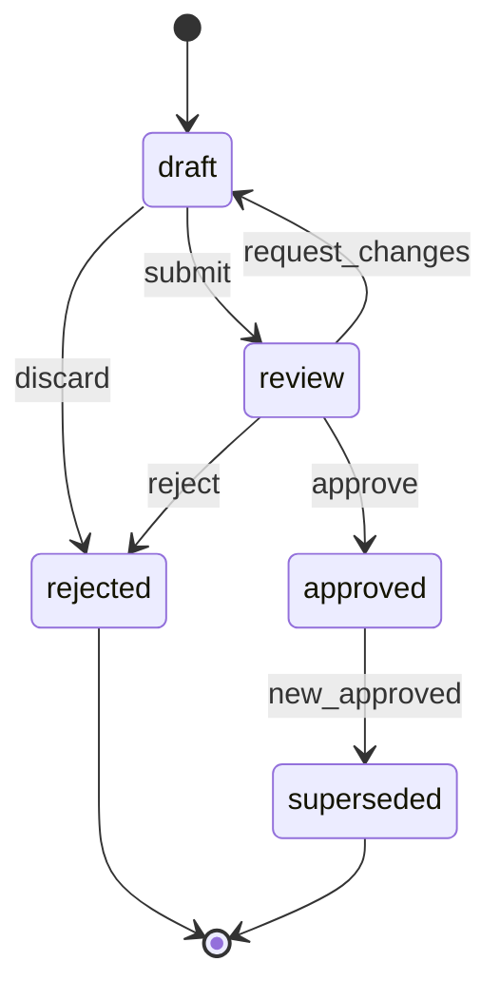

# Revision System

Revisions are the unit of change in PanelOS. Every drawing change, BOM edit, or component swap creates a new revision row; the previous row becomes immutable history. See [ADR-0005](../adr/0005-revision-immutability.md).

## State machine



Mermaid source: [./diagrams/revision-state.mmd](./diagrams/revision-state.mmd).

## Rules

1. Only **one** revision per panel may be `approved` at any time.
2. The panel’s `active_revision_id` always points to that approved revision (or NULL if none yet).
3. Transitions are funneled through `revision_service.transition(rev, action, actor)`:
   - Validates the current state allows `action`.
   - Locks the parent panel row with `SELECT … FOR UPDATE`.
   - On `approve`: sets the prior `active_revision` to `superseded`, sets new one to `approved`, updates `panels.active_revision_id`, all atomically.
   - Writes an `audit_log` entry containing the diff (changed fields + file additions/removals).
4. `approved` and `superseded` revisions are **immutable** — no fields editable.
5. `rejected` is terminal; a rejected draft can be cloned to start a new draft.

## Numbering

- `revision_letter` (A, B, C…) bumped on submit-to-review for a major change.
- `revision_number int` is the monotonic sequence per panel (Alembic-derived sequence per `panel_id`).
- Convention: letter changes for cabling/topology; number changes for component swaps.

## Approval policy

Default: only `Owner` and `Admin` may approve. Toggling the org setting "Engineer-approval allowed" extends approval to `Engineer`. Enforced in `rbac` ([rbac](../security/rbac.md)).

## Diff format

`audit_logs.meta_jsonb` for a `revision.approve` event:

```json
{
  "revision_id": "01HV...",
  "previous_active_id": "01HU...",
  "fields_changed": ["voltage", "current_a"],
  "files_added": ["...sha256..."],
  "files_removed": [],
  "components_added": 3,
  "components_modified": 1,
  "components_removed": 2
}
```

## Public effect

The QR public resolver always serves `panels.active_revision_id`. A scan during a transition window will get the pre-transition revision (row lock guarantees consistent read). See [qr-system](./qr-system.md).
