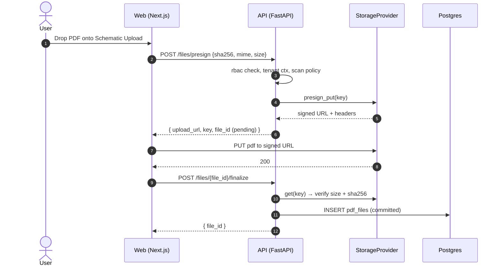

# Storage Abstraction

PanelOS treats object storage as a pluggable dependency. Switching from local disk to S3, Supabase Storage, or Azure Blob is a deployment-time decision driven by `STORAGE_PROVIDER`. See [ADR-0004](../adr/0004-storage-provider-abstraction.md).

## Protocol

```python
class StorageProvider(Protocol):
    async def put(self, key: str, data: BinaryIO, content_type: str) -> StorageObject: ...
    async def get(self, key: str) -> StorageObject: ...
    async def delete(self, key: str) -> None: ...
    async def presign_get(self, key: str, expires_in: int) -> str: ...
    async def presign_put(self, key: str, content_type: str, expires_in: int) -> PresignedUpload: ...
```

Implementations:

| Provider | Module | Used by |
|---|---|---|
| Local filesystem | `storage/local.py` | dev default, tests |
| S3 (and S3-compatible: MinIO, R2, B2) | `storage/s3.py` | compose dev with MinIO; prod with R2 |
| Supabase Storage | `storage/supabase.py` | supabase-hosted tenants |
| Azure Blob | `storage/azure.py` | enterprise on Azure |

The factory:

```python
# storage/factory.py
def get_storage() -> StorageProvider:
    match settings.storage_provider:
        case "local": return LocalStorage(settings.storage_local_path)
        case "s3":    return S3Storage(...)
        case "supabase": return SupabaseStorage(...)
        case "azure": return AzureStorage(...)
```

## Key scheme

```
companies/{company_id}/
  panels/{panel_id}/
    revisions/{revision_id}/
      sheets/{file_id}.pdf
  labels/{label_id}.png
  qr/{qr_token}.svg
  qr/{qr_token}.png
  logos/{company_id}.png
```

All keys are tenant-scoped; cross-tenant key access is impossible by construction.

## Upload sequence



For tiny artifacts (rendered QR PNGs, label PNGs) the API writes directly through `put()` — no presign roundtrip.

## Mermaid source

[./diagrams/storage-upload.mmd](./diagrams/storage-upload.mmd)

## Limits / defaults

- Max PDF upload: 25 MB per sheet (configurable).
- Presigned URL TTL: 300s for PUT, 600s for GET.
- Server-side SHA-256 is mandatory; client-supplied hashes are verified.
