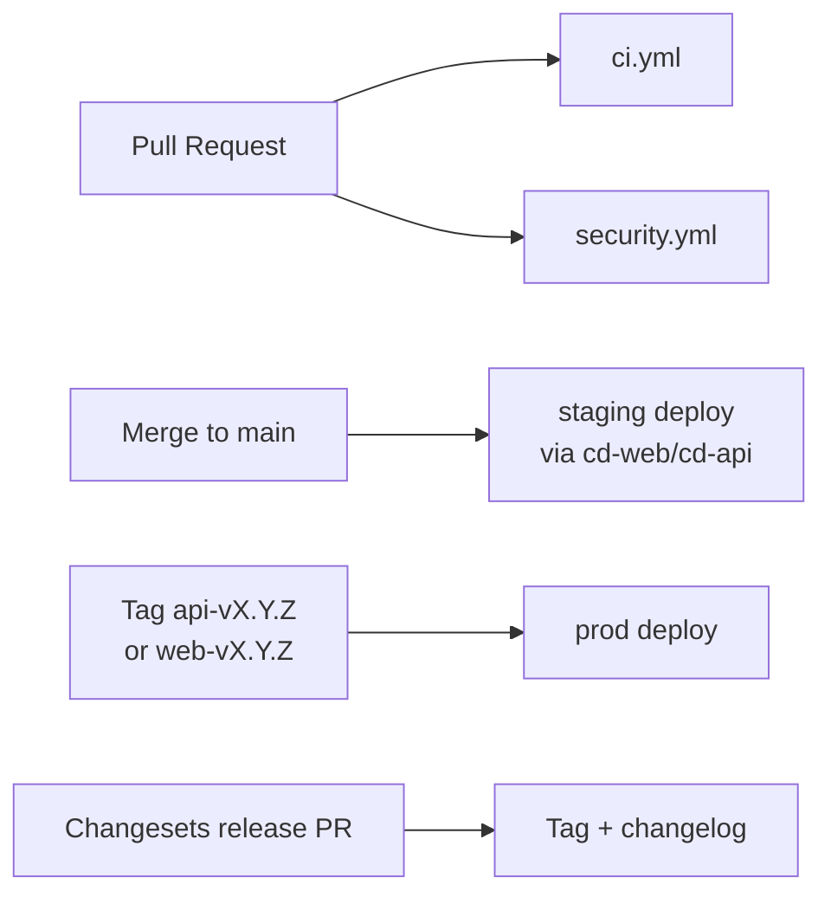

# Pipeline

GitHub Actions workflows orchestrate CI, security scanning, and deploys. All workflows live in `.github/workflows/`.

## Workflow map

## `ci.yml` (on PR + on main)

Jobs (parallel where possible):

| Job | Steps |
|---|---|
| `lint-python` | `uv sync`, `ruff check`, `ruff format --check`, `mypy` |
| `lint-ts` | `pnpm install`, `pnpm -r lint`, `pnpm -r typecheck`, `prettier --check` |
| `test-api` | `uv run pytest -x --cov` with testcontainers Postgres |
| `test-web` | `pnpm -F web test` (vitest) |
| `e2e` | spin up compose stack, seed, `pnpm -F web test:e2e` (Playwright) |
| `build-images` | `docker buildx build` for api and web, cache `gha` |
| `openapi-drift` | run API, `pnpm -F web codegen`, fail if `git diff --exit-code packages/types` |
| `bundle-size` | `pnpm -F web build` + report delta to PR |

Required to merge: all green.

## `security.yml` (on PR + weekly cron)

| Job | Tool |
|---|---|
| `pip-audit` | `pip-audit` against `uv.lock` |
| `pnpm-audit` | `pnpm audit --prod` |
| `gitleaks` | `gitleaks detect` |
| `trivy` | `trivy fs .` + `trivy image` on built images |
| `codeql` | CodeQL TS + Python |
| `license-check` | reject forbidden licenses |

## `cd-web.yml` (on `web-v*` tag + on main for staging)

- Build Next.js bundle.
- `vercel deploy --prod` for tags; `vercel deploy` for staging.
- Smoke test the deployed URL with Playwright `@smoke` tagged tests.

## `cd-api.yml` (on `api-v*` tag + on main for staging)

- Build + push image to GHCR.
- `fly deploy --image ghcr.io/<org>/panelos-api:<tag> -a panelos-api` (or `-staging`).
- `fly ssh console -C "alembic upgrade head"` as a release command.
- Smoke test `/api/v1/health` + a 200 on `/api/v1/panels` with seeded creds.
- Slack `#deploys` notification.

## `release.yml` (Changesets)

- Runs on `main` after merge.
- Maintains a "Version Packages" PR.
- On merge of that PR, tags `api-vX.Y.Z` / `web-vX.Y.Z` and writes `CHANGELOG.md`.

## Branch protection

`main` requires:

- All required jobs green.
- 1 approving review (2 on service-layer changes).
- Signed commits.
- Up-to-date branch.

## Concurrency

`concurrency: { group: ${{ github.workflow }}-${{ github.ref }}, cancel-in-progress: true }` on PR workflows so pushes cancel stale runs.

## Secrets used

- `DOPPLER_TOKEN_*` for app secrets.
- `FLY_API_TOKEN` for deploy.
- `VERCEL_TOKEN` + `VERCEL_ORG_ID` + `VERCEL_PROJECT_ID`.
- `GH_TOKEN` (provided) for releases.
- All scoped to environments (`staging`, `production`) with required reviewers.
