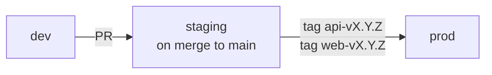

# Environments

Three environments: `dev` (local), `staging`, `prod`. Configuration is **identical by default**; only credentials, scale, and external integrations differ.

## Parity table

| Concern | dev | staging | prod |
|---|---|---|---|
| Web host | `localhost:3000` | `staging.panelos.app` (Vercel preview) | `panelos.app` (Vercel) |
| API host | `localhost:8000` | `api-staging.panelos.app` (Fly.io) | `api.panelos.app` (Fly.io) |
| Postgres | Docker (compose) | Neon branch | Neon main |
| Redis | Docker | Upstash dev | Upstash prod |
| Storage | Local FS / MinIO | R2 staging bucket | R2 prod bucket |
| Email | MailHog | Resend test | Resend live |
| Secrets | `.env` | Doppler `stg` | Doppler `prod` |
| JWT keys | committed dev keys | Doppler-injected | Doppler-injected, rotated quarterly |
| Observability | logs to stdout | OTel → Grafana Cloud `stg` | OTel → Grafana Cloud `prod` |
| Backups | none | nightly | nightly + WAL |
| Domain TLS | none | LetsEncrypt | LetsEncrypt + HSTS preload |
| Rate limiting | off | on (relaxed) | on |
| Webhooks | smee.io | real recipients | real recipients |

## Promotion flow

- Every merge to `main` deploys to staging (automated).
- Production deploys are tag-driven and require approval in the GitHub environment.

## Environment-specific behavior

PanelOS reads `ENV={dev,staging,prod}` from settings:

- `dev`: hot reload, verbose tracebacks, seed reset allowed, no rate limit, MailHog.
- `staging`: prod-like but with synthetic data flag.
- `prod`: structured logs only, full rate limits, PII scrubbing on errors.

## Feature flags

Per-tenant flags live in `companies.feature_flags jsonb`. Environment-level kill switches live in Redis under `flags:env:<key>`.
