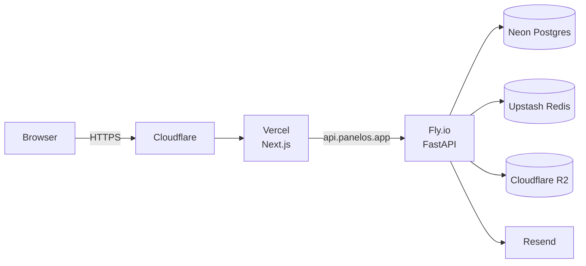

# Production

Recommended platform topology for the PanelOS managed offering. Self-host instructions are derived from the same Docker images.

## Recommended (default)

| Concern | Provider | Why |
|---|---|---|
| Web | **Vercel** | First-class Next.js 15, instant previews, edge caching for marketing pages |
| API | **Fly.io** | Long-lived processes, multi-region, simple deploys via GHA |
| Postgres | **Neon** | Branching, autoscale, point-in-time restore |
| Redis | **Upstash** | Serverless, pay-per-request, multi-region replicas |
| Object storage | **Cloudflare R2** | S3-compatible, no egress fees, geo-near customers |
| Email | **Resend** | Developer-first, SPF/DKIM trivial |
| Observability | **Grafana Cloud** | OTel-native, logs+metrics+traces in one |
| Secrets | **Doppler** + **GitHub OIDC** | env-scoped, audit trail |
| DNS / TLS | **Cloudflare** | DNS, edge cache, automatic TLS |

## Alternative — AWS-only

For customers on AWS procurement:

| Concern | Service |
|---|---|
| Web | ECS Fargate or App Runner |
| API | ECS Fargate |
| Postgres | RDS Postgres 16 |
| Redis | ElastiCache |
| Object storage | S3 |
| Secrets | AWS Secrets Manager |
| Observability | CloudWatch + AWS Distro for OTel |

The `STORAGE_PROVIDER=s3` and Postgres/Redis URL settings make this swap a config-only change.

## Topology

## Scaling rules of thumb

- API: 2 machines × 1 vCPU / 512 MB to start; autoscale on CPU > 70%.
- Worker: 1 machine × 1 vCPU / 512 MB; scale on queue depth.
- Postgres: Neon autoscale 0.25 → 4 CU; read replica when read p95 > 80ms.
- Storage: no scaling — R2 elastic.

See [scaling](./scaling.md) for the deeper playbook.

## Deploys

- API: GitHub Actions → `fly deploy --image ghcr.io/<org>/panelos-api:<tag>` → `fly ssh console -C "alembic upgrade head"` as a release command.
- Web: GitHub Actions → `vercel deploy --prod` from tag.

See [ci-cd/pipeline](../ci-cd/pipeline.md), [release](../ci-cd/release.md), [rollback](../ci-cd/rollback.md).
