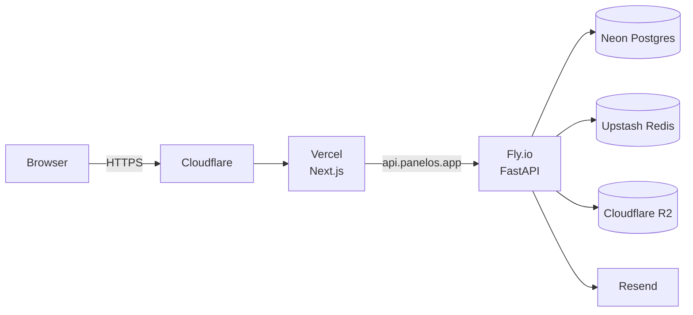

# Production

> **DEPRECATED**: this file documents the original Railway + Vercel + Supabase
> MVP stack. The live production deployment moved to AWS in June 2026 — see
> [`aws.md`](./aws.md) for the current topology, env vars, and runbooks.
>
> Sections below are kept for historical context (provider names, migration
> notes) but should not be used when configuring a new environment.

Recommended platform topology for the PanelOS managed offering. Self-host instructions are derived from the same Docker images.

## Original production stack (pre-AWS, June 2026)

The MVP ran on this concrete stack until the AWS migration. The `STORAGE_PROVIDER` / `DATABASE_URL` / `REDIS_URL` settings keep every provider a config-only swap, so any of these vendors remains reachable as a fallback.

| Concern | Provider | Notes |
|---|---|---|
| Web | **Vercel** | `panelos-web.vercel.app`, root `apps/web`. Browser uses `NEXT_PUBLIC_API_BASE=/api/v1`; the Next rewrite proxies `/api/v1/*` to `API_INTERNAL_URL` (the Railway API) same-origin so auth cookies flow through. |
| API | **Railway** | `panelos-production.up.railway.app`, Docker image from `apps/api`, auto-deploy on `main`. The container boots via `scripts/start.sh`, which runs `alembic upgrade head` before uvicorn — **migrations apply automatically on every deploy**. |
| Postgres | **Supabase** | eu-west-1 pooler via `DATABASE_URL`. PITR / backups managed by Supabase. |
| Object storage | **Supabase Storage** | Private bucket `panelos`, signed short-lived URLs. Set `STORAGE_PROVIDER=supabase` + `SUPABASE_URL` / `SUPABASE_SERVICE_KEY` / `SUPABASE_BUCKET`. |
| Email | **SMTP / log** | `core/email.py` logs invites unless SMTP creds set. Wire Resend/SMTP for real delivery. |
| Error tracking | **Sentry** (optional) | Enabled only when `SENTRY_DSN` set. |

### Production env (Railway)

Required: `DATABASE_URL`, `JWT_SECRET`, `APP_URL`, `NEXT_PUBLIC_APP_URL`, `STORAGE_PROVIDER`.
Storage (when `supabase`): `SUPABASE_URL`, `SUPABASE_SERVICE_KEY`, `SUPABASE_BUCKET=panelos`.
Optional: `SENTRY_DSN`, `SMTP_*`, `REDIS_URL`, `CORS_ORIGINS`, `RATE_LIMIT_ENABLED` (default `true`).

### Web env (Vercel)

- `NEXT_PUBLIC_API_BASE=/api/v1` — keep relative in every environment (same-origin, cookies flow through the rewrite).
- `API_INTERNAL_URL=https://panelos-production.up.railway.app` — the rewrite target (the legacy `NEXT_PUBLIC_API_URL` still works as a fallback).
- `NEXT_PUBLIC_APP_URL` — the public web origin.

### Environments (prod vs preview)

Single production environment today; Vercel **preview deploys** (per-PR) cover staging needs.

- **Production** (Vercel `main` + Railway `main` + Supabase): `API_INTERNAL_URL` → the prod Railway URL; `RATE_LIMIT_ENABLED=true`; `STORAGE_PROVIDER=supabase`.
- **Preview** (Vercel PR builds): point `API_INTERNAL_URL` at the same Railway API (or a preview API if/when one exists). Previews are non-authoritative — do not run destructive migrations from them.
- DB migrations are owned by the **API** boot (`start.sh`), so only the API environment that boots against a given `DATABASE_URL` mutates that schema.

### Pre-launch checklist

- [ ] Rotate any secrets shared during setup (Supabase DB password, GitHub PATs, `JWT_SECRET`).
- [ ] `STORAGE_PROVIDER=supabase` + private `panelos` bucket created; upload survives a Railway redeploy.
- [ ] `CORS_ORIGINS` / `APP_URL` locked to the Vercel origin; `allow_credentials` true.
- [ ] `RATE_LIMIT_ENABLED=true` in prod; auth endpoints throttle (429 after burst).
- [ ] Health check `GET /api/v1/health` wired to Railway.
- [ ] Supabase PITR / backups confirmed.
- [ ] Invite email actually delivers (SMTP creds) — else invites only log.
- [ ] Full 14-step flow (create panel → upload PDF → draft → approve → QR → label PNG+PDF) passes on prod with persistent files.
- [ ] `develop` → `main` release flow green (unit + integration + web typecheck/lint).

## Recommended (default)

| Concern | Provider | Why |
|---|---|---|
| Web | **Vercel** | First-class Next.js 15, instant previews, edge caching for marketing pages |
| API | **Fly.io** | Long-lived processes, multi-region, simple deploys via GHA |
| Postgres | **Neon** | Branching, autoscale, point-in-time restore |
| Redis | **Upstash** | Serverless, pay-per-request, multi-region replicas |
| Object storage | **Cloudflare R2** | S3-compatible, no egress fees, geo-near customers |
| Email | **Resend** | Developer-first, SPF/DKIM trivial |
| Observability | **Grafana Cloud** | OTel-native, logs+metrics+traces in one |
| Secrets | **Doppler** + **GitHub OIDC** | env-scoped, audit trail |
| DNS / TLS | **Cloudflare** | DNS, edge cache, automatic TLS |

## Alternative — AWS-only

For customers on AWS procurement:

| Concern | Service |
|---|---|
| Web | ECS Fargate or App Runner |
| API | ECS Fargate |
| Postgres | RDS Postgres 16 |
| Redis | ElastiCache |
| Object storage | S3 |
| Secrets | AWS Secrets Manager |
| Observability | CloudWatch + AWS Distro for OTel |

The `STORAGE_PROVIDER=s3` and Postgres/Redis URL settings make this swap a config-only change.

## Topology

## Scaling rules of thumb

- API: 2 machines × 1 vCPU / 512 MB to start; autoscale on CPU > 70%.
- Worker: 1 machine × 1 vCPU / 512 MB; scale on queue depth.
- Postgres: Neon autoscale 0.25 → 4 CU; read replica when read p95 > 80ms.
- Storage: no scaling — R2 elastic.

See [scaling](./scaling.md) for the deeper playbook.

## Deploys

Live MVP:
- API: push to `main` → Railway auto-builds the `apps/api` Docker image and deploys; the container's `start.sh` runs `alembic upgrade head` before uvicorn, so schema migrations apply on boot.
- Web: push to `main` → Vercel builds `apps/web` and promotes to production; PRs get preview deploys.

Target (recommended topology, once migrated off Railway/Supabase):
- API: GitHub Actions → deploy `ghcr.io/<org>/panelos-api:<tag>` → run `alembic upgrade head` as a release command.
- Web: GitHub Actions → `vercel deploy --prod` from tag.

See [ci-cd/pipeline](../ci-cd/pipeline.md), [release](../ci-cd/release.md), [rollback](../ci-cd/rollback.md).
