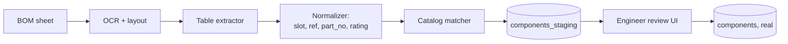

# BOM Parsing

Engineers spend non-trivial time transcribing BOMs from vendor PDFs into the structured `components` table. A parser shortens this dramatically.

## Goals

1. From a BOM-tagged sheet, propose `Component` rows ready for review.
2. Match part numbers against an internal catalog where possible.
3. Highlight unmatched lines for human review.

## Pipeline

## Schema

`components_staging` mirrors `components` plus:

- `confidence numeric` — model-reported confidence per row.
- `source_bbox jsonb` — where on the page the row came from (for the review UI to highlight).
- `accepted_by uuid NULL` / `accepted_at timestamptz NULL`.

## Catalog

A future `parts_catalog` table holds normalized vendor parts (NorthForge-curated to start, public catalogs later). The matcher uses fuzzy matching on `part_number` plus rating sanity checks.

## Quality

- Engineer always sees the staged rows; nothing is silently accepted.
- Acceptance writes a `Component` row and removes the staged row.
- Rejection writes a feedback signal that feeds back into matcher training.

## Out of scope (still)

- Editing the BOM via OCR-driven UI directly on the PDF. Engineers edit through the existing Components tab; parsing only proposes.
