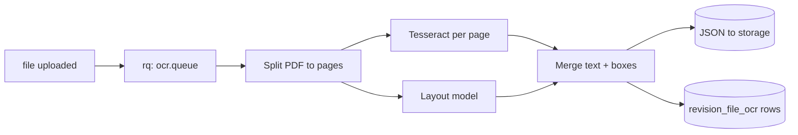

# OCR / Vision

Many schematics arrive as scanned PDFs (vendor-supplied as-builts). OCR + layout-aware vision lets PanelOS turn those into searchable, structured BOMs.

## Capabilities (planned)

1. **OCR pass** — extract text from every page. Output stored as `revision_files.ocr_text_storage_key`.
2. **Title-block extraction** — read drawing number, scale, sheet, revision letter, date.
3. **Symbol detection** — identify breakers, contactors, terminals on layout drawings.
4. **Cross-reference resolution** — turn `K3` on sheet 1 into a link to its detail on sheet 4.

## Stack

- OCR baseline: **Tesseract** for English/EU languages; **Surya** for layout-aware OCR where licensing allows.
- Vision: open-weight multimodal model (Qwen-VL family or similar) for symbol detection.
- Runs as a background worker, triggered on `file.uploaded`.
- Output written to a new `revision_file_ocr` table (planned).

## Pipeline

## Tenant controls

- Opt-in per tenant.
- Output stays on the tenant’s storage bucket.
- Source PDFs never leave the cluster unless a hosted model is enabled.

## Quality bar

- ≥ 95% character accuracy on machine-generated PDFs.
- ≥ 85% on clean scanned drawings.
- Output is **augmentation**, not source of truth. Engineers always have the option to override.

## Privacy

Schematics are **Confidential** ([data-classification](../security/data-classification.md)). OCR text inherits that class.
