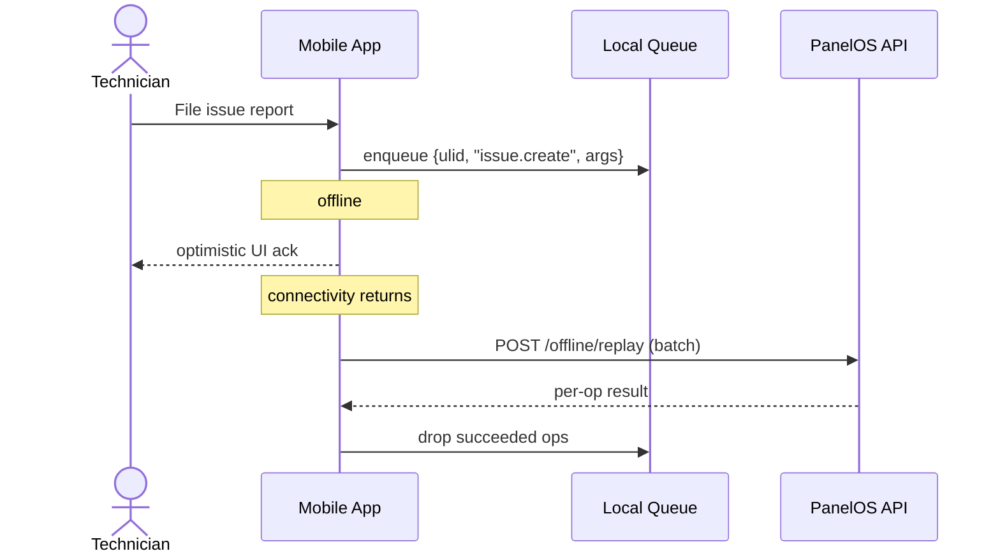

# Offline Sync (Mobile)

Field technicians work in basements, cold rooms, and concrete plant rooms — connectivity is unreliable. The mobile app must keep working offline and reconcile cleanly when it returns.

## What needs to work offline

- View a previously cached panel.
- View a previously cached schematic.
- File an issue report (queued).
- Record a scan event (queued).

## What does **not** work offline

- Approving revisions.
- Editing components or revisions.
- Inviting users.

## Approach — **op-log over CRDT**

For our workload (small writes, mostly append-only, no concurrent edits to the same field), an **operation log** is simpler than a full CRDT.

- Each offline write is queued as an op: `{client_op_id (ulid), op_type, args, occurred_at}`.
- The queue is encrypted at rest in the device’s secure enclave.
- On reconnect, ops replay sequentially against `/api/v1/offline/replay`.
- The server is idempotent on `client_op_id`.

## Conflict policy

- Reads: **server wins** on conflict (the active revision the server knows is authoritative).
- Writes (issue.create, scan.record): **append-always**; no conflict possible because ops are inherently additive.

## Cache eviction

- LRU on the device, capped at 200 MB by default.
- User can pin specific panels for guaranteed availability.

## Why not CRDT

CRDTs shine when concurrent edits to the same field by multiple offline clients are common. PanelOS does not have that workload — revisions are sequenced through approval; technicians don’t edit them. The op-log model is half the complexity at the same correctness.

## Future

If we ever ship technician-level edits to BOMs or location moves, we revisit CRDT (likely Y.js).
