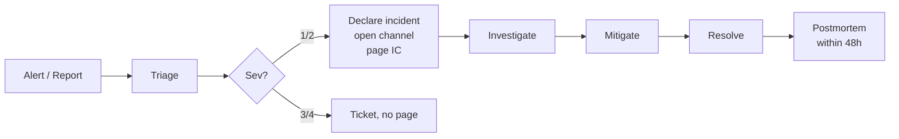

# Incident Response

## Severity levels

| Sev | Definition | Examples |
|---|---|---|
| 1 | Customer-visible outage or data loss | API down; data leak; audit chain break |
| 2 | Significant degradation, workaround exists | Uploads failing; one tenant locked out |
| 3 | Minor degradation or risk | Single endpoint slow; webhook backlog |
| 4 | Internal-only / no customer impact | CI flake; metric gap |

## Roles

- **Incident Commander (IC)** — coordinates, decides, owns comms.
- **Comms Lead** — drafts customer + Statuspage updates.
- **Scribe** — keeps timeline in `#incident-<id>` channel.
- **Tech Lead** — leads diagnosis + mitigation.

For Sev-1, all four roles must be filled (IC may double as Tech Lead until a second engineer joins).

## Flow



## Communications template

Statuspage / customer email:

> **[Investigating]** We are investigating reports of failed uploads. Customers may see errors when attaching PDFs to revisions. We will provide an update within 30 minutes.
>
> **[Identified]** We have identified the cause as a credential issue with our object storage provider. Mitigation is in progress.
>
> **[Monitoring]** A fix has been applied. We are monitoring for stability.
>
> **[Resolved]** This incident is resolved. A postmortem will be published within 5 business days.

## Postmortem template

```markdown
# Incident PM — YYYY-MM-DD — <short title>

## Summary
<2-3 sentences>

## Impact
- Window: <start> – <end> (UTC)
- Tenants affected: <count or list>
- Data loss: <none / scope>

## Timeline
- 12:00Z — Alert fired
- 12:03Z — IC acked
- ...
- 12:47Z — Mitigation complete
- 13:30Z — Resolved

## Root cause
<technical>

## Contributing factors
- ...

## What went well
- ...

## What went poorly
- ...

## Action items
- [ ] <owner> <due date> — <action>
- [ ] ...

## Customer-facing summary
<as published>
```

Blameless. Action items go into the next sprint with owners and due dates.
