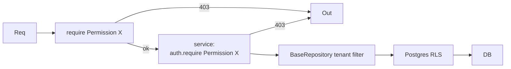

# RBAC

Five roles per tenant. Permissions are checked at three layers: FastAPI dependency (`require(Permission.X)`), service-layer assertion, and Postgres RLS as backstop.

## Roles

| Role | Description |
|---|---|
| Owner | Founding admin; manages billing and org settings |
| Admin | Manages users, locations, integrations |
| Engineer | Creates panels and revisions; can approve when org setting allows |
| Technician | Reads panels and revisions; reports issues; mobile scans |
| Viewer | Read-only across the tenant |

## Permission matrix

| Permission | Owner | Admin | Engineer | Technician | Viewer |
|---|---|---|---|---|---|
| Manage org / billing | ✓ | – | – | – | – |
| Manage users | ✓ | ✓ | – | – | – |
| Configure locations | ✓ | ✓ | – | – | – |
| Configure integrations | ✓ | ✓ | – | – | – |
| Configure branding / templates | ✓ | ✓ | – | – | – |
| Create / edit / archive panels | ✓ | ✓ | ✓ | – | – |
| Create revision draft | ✓ | ✓ | ✓ | – | – |
| Submit revision for review | ✓ | ✓ | ✓ | – | – |
| Approve revision | ✓ | ✓ | ✓ * | – | – |
| Reject revision | ✓ | ✓ | ✓ * | – | – |
| Upload PDF | ✓ | ✓ | ✓ | – | – |
| Generate labels | ✓ | ✓ | ✓ | – | – |
| Print label batch | ✓ | ✓ | ✓ | – | – |
| View panel detail | ✓ | ✓ | ✓ | ✓ | ✓ |
| Scan QR (mobile or web) | ✓ | ✓ | ✓ | ✓ | ✓ |
| Report issue on panel | ✓ | ✓ | ✓ | ✓ | – |
| Read audit log | ✓ | ✓ | – | – | – |
| Read scan events | ✓ | ✓ | ✓ | – | – |
| Manage API keys | ✓ | – | – | – | – |

`*` Engineer approval is gated by the org-level flag `companies.feature_flags.engineer_approval`. Default off.

## Enforcement layers

1. **FastAPI dep** — `Depends(require(Permission.PANEL_CREATE))` on the router. Returns 403 if missing.
2. **Service-layer check** — `auth.require(actor, Permission.X)` for paths that may bypass the router (background jobs).
3. **Postgres RLS** — every tenant-scoped table filters by `current_setting('app.company_id')`. A forgotten check returns zero rows instead of leaking; mutations fail.



## Permission enum

Defined in `apps/api/src/panelos_api/core/rbac.py`:

```python
class Permission(StrEnum):
    ORG_MANAGE = "org.manage"
    USERS_MANAGE = "users.manage"
    LOCATIONS_MANAGE = "locations.manage"
    INTEGRATIONS_MANAGE = "integrations.manage"
    BRANDING_MANAGE = "branding.manage"
    PANEL_CRUD = "panels.crud"
    REVISION_DRAFT = "revisions.draft"
    REVISION_SUBMIT = "revisions.submit"
    REVISION_APPROVE = "revisions.approve"
    REVISION_REJECT = "revisions.reject"
    FILE_UPLOAD = "files.upload"
    LABEL_GENERATE = "labels.generate"
    LABEL_PRINT_BATCH = "labels.batch"
    PANEL_VIEW = "panels.view"
    QR_SCAN = "qr.scan"
    ISSUE_REPORT = "issues.report"
    AUDIT_READ = "audit.read"
    SCANS_READ = "scans.read"
    APIKEY_MANAGE = "apikeys.manage"
```

`ROLE_TO_PERMISSIONS` map binds role enum → set of permissions.

## Custom roles

Out of MVP scope. The matrix above is fixed for v1. Custom roles are a planned [roadmap](../future/roadmap.md) item.
